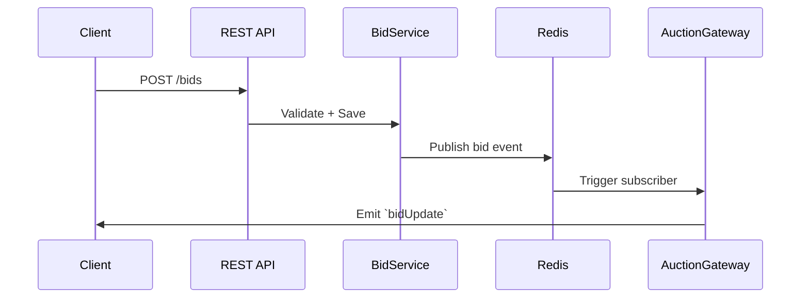

# 🏗️ Auction System Architecture

This document outlines the high-level architecture and component interactions in the Car Auction System built using NestJS.

---

## 🔧 Technologies Used

* **NestJS** (Backend framework)
* **Prisma** (ORM for PostgreSQL)
* **PostgreSQL** (Primary database)
* **Redis** (Pub/Sub and WebSocket session tracking)
* **RabbitMQ** (Asynchronous event queues)
* **Socket.IO** (Real-time communication)
* **JWT** (Authentication)
* **Swagger** (API documentation)

---

## 🧱 System Components

### 1. `AuctionService`

Handles auction lifecycle:

* Creating auctions
* Transitioning auction status (`PENDING` → `ACTIVE` → `COMPLETED`)
* Assigning winners
* Interacts with Prisma for DB operations

### 2. `BidService`

* Validates and processes bids
* Ensures concurrency-safe bid updates
* Publishes bid data to Redis for real-time syncing

### 3. `AuctionGateway`

* WebSocket server for real-time features
* Clients join auction rooms
* Receives `join-auction` events
* Broadcasts `bidUpdate`, `auction-ended` to specific auction rooms
* Enforces IP-based connection limits

### 4. `RedisService`

* Manages Redis publisher/subscriber clients
* Used for real-time bid synchronization across nodes
* Tracks WebSocket session limits by IP (optional)

### 5. `RabbitMQService`

* Publishes events to:

  * `bid.queue` (asynchronous bid processing)
  * `notification.queue` (WebSocket/email alerts)
  * `audit.queue` (logs for auction activity)

### 6. `Scheduler`

* Cron job runs every 30 seconds to:

  * Start `PENDING` auctions
  * Complete `ACTIVE` auctions that have ended
  * Determine winner and notify

### 7. `AuthModule`

* Validates JWTs
* Adds Redis-based blacklist for logout/invalidation

---

## 🔄 Data Flow: Real-Time Bid

---

## 🎯 Auction Status Flow

1. **PENDING**: Auction created, but not yet started
2. **ACTIVE**: Scheduler detects startTime reached
3. **COMPLETED**: Scheduler detects endTime reached, sets winner

---

## 🛡️ Security & DDoS Protection

* JWT-based authentication with Redis blacklist
* WebSocket IP-based connection limits (max 3 per IP)
* Bid throttling with `@nestjs/throttler`

---

## 📡 WebSocket Events

| Event           | Direction       | Description                  |
| --------------- | --------------- | ---------------------------- |
| `join-auction`  | Client → Server | Join a specific auction room |
| `bidUpdate`     | Server → Client | New bid placed               |
| `auction-ended` | Server → Client | Winner announced             |

---

## 🔔 Queues Used

| Queue                | Purpose                         |
| -------------------- | ------------------------------- |
| `bid.queue`          | Async bid processing            |
| `notification.queue` | Email/WebSocket notifications   |
| `audit.queue`        | Logging events to database/file |

---

## ✅ Summary

This system is modular, scalable, and uses Redis & RabbitMQ for real-time and async tasks. Each module is loosely coupled and adheres to NestJS best practices for maintainability and testing.

If deployed across multiple instances, Redis and RabbitMQ ensure consistency in auction state and bid synchronization.

create .md  file 
ß